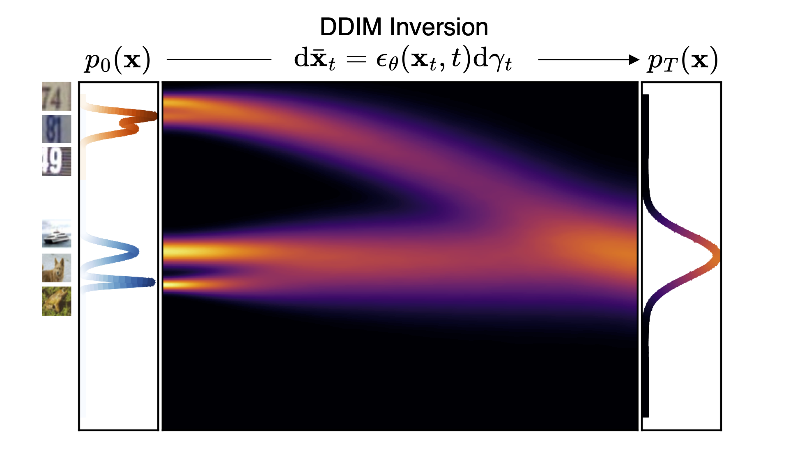

<div align="center">

# Out-of-Distribution Detection with a Single Unconditional Diffusion Model

[](https://arxiv.org/abs/2405.11881)
[](https://opensource.org/licenses/MIT)
[](https://nips.cc/)

</div>

<p align="center">
  
  <br />
  <span>Figure 1: Illustration of the diffusion paths of two samples from two different distributions (CIFAR10 and SVHN) obtained
  via DDIM integration. The paths have different first and second derivatives (rate-of-change and
  curvature). We propose to measure these quantities for OOD detection.</span>
</p>

This is the official code repository for the NeurIPS 2024 paper [Out-of-Distribution Detection with a Single Unconditional Diffusion Model (DiffPath)](https://arxiv.org/abs/2405.11881). The codebase is based on [openai/improved-diffusion](https://github.com/openai/improved-diffusion).

## Installation

It is recommended to install dependencies in a ```conda``` environment:
```
conda create --name diffpath python=3.8
pip install -r requirements.txt
```

## Download Diffusion Model Checkpoints
### CelebA 32x32
We provide our pretrained diffusion model checkpoint on CelebA 32x32 at [https://huggingface.co/ajrheng/diffpath/tree/main](https://huggingface.co/ajrheng/diffpath/tree/main). Alternatively,
```
wget https://huggingface.co/ajrheng/diffpath/resolve/main/celeba_ema_0.9999_499999.pt
```

### ImageNet 64x64
Download the ImageNet-64 diffusion model checkpoint trained with ```L-hybrid``` objective from the [openai/improved-diffusion](https://github.com/openai/improved-diffusion) repo. Alternatively,
```
wget https://openaipublic.blob.core.windows.net/diffusion/march-2021/imagenet64_uncond_100M_1500K.pt
```

## OOD Detection with DiffPath
To perform OOD detection with DiffPath, first we calculate the diffusion path statistics for both train and test sets. We demonstrate the steps for the task of CIFAR10 (in-dist) vs SVHN (out-of-dist). 
```
# calculate statistics for CIFAR10 training set on GPU ID 0 using DM with CelebA as base distribution
python save_train_statistics.py --model celeba --data_dir /path/to/cifar10/dataset --dataset cifar10 --model_path /path/to/celeba/model/checkpoint --config configs/celeba_model_config.yaml --batch_size 256 --n_ddim_steps 10 --device 0
```
```
# calculate statistics for CIFAR10 test set on GPU ID 0
python save_test_statistics.py --model celeba --data_dir /path/to/cifar10/dataset --dataset cifar10 --model_path /path/to/celeba/model/checkpoint --config configs/celeba_model_config.yaml --batch_size 256 --n_ddim_steps 10 --device 0
```
```
# calculate statistics for SVHN test set on GPU ID 0
python save_test_statistics.py --model celeba --data_dir /path/to/svhn/dataset --dataset svhn --model_path /path/to/celeba/model/checkpoint --config configs/celeba_model_config.yaml --batch_size 256 --n_ddim_steps 10 --device 0
```
The statistics will be saved as ```.npz``` files in ```train_statistics_celeba_model/ddim10``` and ```test_statistics_celeba_model/ddim10``` respectively.

Now perform OOD detection using DiffPath-6D:
```
python eval_6d.py --model celeba --in_dist cifar10 --out_of_dist svhn --n_ddim_steps 10
```
The results will be printed to the screen.

## BibTeX
If you find this repository or the ideas presented in our paper useful, please consider citing our work.
```
@article{heng2024out,
  title={Out-of-Distribution Detection with a Single Unconditional Diffusion Model},
  author={Heng, Alvin and Thiery, Alexandre H and Soh, Harold},
  journal={arXiv preprint arXiv:2405.11881},
  year={2024}
}
```
